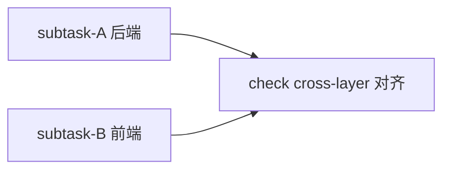

# 实施：cli-upgrade-gate

## subtask 拆分（2 subtask，文件集不相交，可并行）

### subtask-A 后端（Rust）
- **write-files**: src-tauri/src/commands/cli_env.rs, src-tauri/src/commands/test_cli_env.rs, src-tauri/Cargo.toml, src-tauri/src/startup.rs
- **exec-scope**: commands/cli_env 全部 + Cargo + startup handler 注册
- **工作**:
  1. cli_upgrade/cli_install/cli_diagnose_conflicts 改 async + tokio::process::Command（替换 std::process::Command::output()），保留 no_window()
  2. CliToolStatus 加 latest_version: Option<String> + has_update: Option<bool>（serde skip_serializing_if None）
  3. 新 cli_check_updates async command：reqwest no_proxy timeout 8s 打 registry.npmjs.org/<pkg>/latest，semver 比对，1h 缓存（tokio RwLock HashMap）
  4. Cargo.toml 加 semver = "1"
  5. startup.rs 注册 cli_check_updates
  6. test_cli_env.rs 加 semver 比对单测

### subtask-B 前端（TS）
- **write-files**: src/services/api/system.ts, src/services/api/types/part4.ts, src/pages/About.tsx, src/locales/*.json (8)
- **exec-scope**: api 封装 + 类型 + About 页 + i18n
- **工作**:
  1. system.ts cliEnvApi 加 checkUpdates() invoke cli_check_updates
  2. part4.ts CliToolStatus 加 latest_version?: string + has_update?: boolean
  3. About.tsx 升级按钮条件 `s.installed && !s.broken && s.has_update === true`（line ~381/393）；handleCliCheck 追加 checkUpdates；latest_version 展示
  4. 8 locale 加 about.localEnv.latestVersion / newVersionAvailable

## 调度图

A/B 文件集不相交（Rust vs TS），并行派。check 阶段验 cross-layer（#[tauri::command] 签名 ↔ api.ts invoke ↔ TS 类型 ↔ serde 字段名四向对齐）。

## 验收（check 阶段）
- cargo build/clippy/test clean
- yarn build clean
- check-i18n 过
- cross-layer cli_check_updates 签名 ↔ checkUpdates() invoke ↔ CliToolStatus 类型 ↔ serde 字段对齐
- 点升级按钮实测不卡（codex/claude）
- has_update===true 才展示升级按钮
