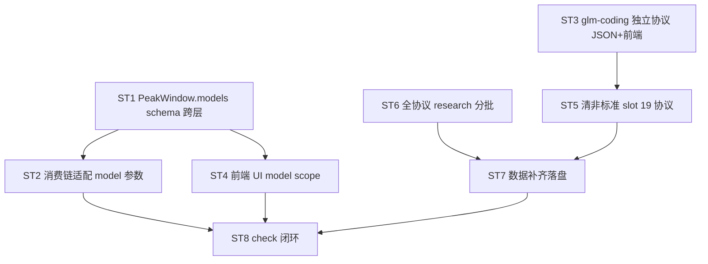

# Design — platform-presets 全面检修

> 配套 `prd.md`。聚焦架构决策 + 跨层契约 + subtask DAG。数据细节（per 协议 model_list）走 exec 阶段 research subtask。

## 1. peak_hours model scope schema 扩展

### 1.1 PeakWindow 新字段

```rust
pub struct PeakWindow {
    pub start_hour: u32,
    pub end_hour: u32,
    pub multiplier: f64,
    #[serde(default)]
    pub days_of_week: Option<Vec<u32>>,
    #[serde(default)]
    pub start_minute: Option<u32>,
    #[serde(default)]
    pub end_minute: Option<u32>,
    #[serde(default)]
    pub days_of_month: Option<Vec<u32>>,
    #[serde(default)]
    pub models: Option<Vec<String>>,   // ← 新增；absent/None = 全平台模型生效
    #[serde(default)]
    pub starts_at: Option<i64>,        // ← 新增；Unix 秒，absent=立即可用；epoch_sec < starts_at → 窗口未启用跳过
    #[serde(default)]
    pub expires_at: Option<i64>,       // ← 新增；Unix 秒，absent=永久；epoch_sec ≥ expires_at → 窗口失效跳过
}
```

TS 镜像（`defaults.ts::PeakWindow`）：
```ts
models?: string[];      // absent = 全平台
starts_at?: number;     // Unix 秒，absent = 立即可用
expires_at?: number;    // Unix 秒，absent = 永久
```

向后兼容：`#[serde(default)]` + TS optional，旧 JSON 无 `models` 视为全平台（= 现行为）。

### 1.2 hit 语义（model 过滤）

时间命中后增 model 维度判定：

```rust
// 伪码：resolve_multiplier(windows, epoch_ms, request_model)
let epoch_sec = epoch_ms / 1000;
for w in windows {
    // 生效期判定（starts_at/expires_at，Unix 秒）
    if let Some(s) = w.starts_at { if epoch_sec < s { continue; } }     // 未到生效时间 → 跳过
    if let Some(e) = w.expires_at { if epoch_sec >= e { continue; } }   // 已失效 → 跳过
    if !time_hit(w, ...) { continue; }
    if let Some(ref models) = w.models {
        if !models.iter().any(|m| model_match(m, request_model)) { continue; }  // 窗口限定模型，请求模型不在内 → 跳过
    }
    return w.multiplier;  // 生效期 + 时间 + model 三重命中
}
1.0
```

- `model_match(pattern, actual)`：精确匹配 OR 前缀通配（如 `"glm-5.2*"` 覆盖 `glm-5.2` / `glm-5.2-turbo`）。exact-first，通配次之。ST1 定型。
- `request_model` 来源：proxy handler 拿 request body `model` 字段；est_cost 估算时拿 `proxy_log.model`；stats_today 用 `proxy_log.model`。
- disable_during_peak（router）：`is_in_peak_window(windows, now_ms, model)` 同理加 model 过滤（窗口限 model 且请求 model 在内才算「命中该窗口」→ 排除）。

### 1.3 GLM 规则精确表达

`glm-coding` 协议 peak_hours（高峰 3 倍永久 + 非高峰 2 倍 10-01 启用，first-match 高峰排前）：
```json
"peak_hours": [
  {
    "start_hour": 6, "end_hour": 10, "multiplier": 3.0,
    "models": ["glm-5.2", "glm-5-turbo"]
  },
  {
    "start_hour": 0, "end_hour": 24, "multiplier": 2.0,
    "models": ["glm-5.2", "glm-5-turbo"],
    "starts_at": 1759276800
  }
]
```
- 高峰窗口（06-10 UTC = 14-18 UTC+8）：3 倍，永久。
- 非高峰窗口（全天兜底）：2 倍，`starts_at` = 2026-10-01 00:00:00 UTC+8 = Unix 1759276800。9-30 前未启用 → 非高峰默认 1.0（限时福利 1 倍抵扣）；10-01 起启用 → 非高峰 2 倍。first-match：高峰窗口排前覆盖非高峰窗口的重叠时段（高峰期命中 3 倍而非 2 倍）。
- 福利期截止自动切换，无需手工改 preset。

`glm`（普通）无 peak_hours（删）。

## 2. glm / glm-coding 双协议结构

### 2.1 glm-coding 新条目（预填，research ST6 校准）

```json
"glm-coding": {
  "client_type": "codex_tui",
  "endpoints": {
    "default": [
      { "protocol": "openai", "base_url": "https://open.bigmodel.cn/api/coding/paas/v4", "client_type": "codex_tui" },
      { "protocol": "anthropic", "base_url": "https://open.bigmodel.cn/api/anthropic", "client_type": "claude_code" }
    ]
  },
  "models": {
    "default": { "default": "glm-5.2", "opus": "glm-5.2", "sonnet": "glm-5.2", "gpt": "glm-5-turbo" }
  },
  "model_list": ["glm-5.2", "glm-5-turbo"],
  "name": "智谱 GLM Coding Plan",
  "desc": "...",
  "peak_hours": [{ "start_hour": 6, "end_hour": 10, "multiplier": 3.0, "models": ["glm-5.2","glm-5-turbo"] }]
}
```
- base_url 已由 ST6 research 校准（OQ3 解决）：OpenAI 协议 coding plan = `https://open.bigmodel.cn/api/coding/paas/v4`（比普通版多 `/coding/` 段，见 research/glm-coding.md，源 https://docs.bigmodel.cn/cn/coding-plan/quick-start）；Anthropic 协议路径同普通版 `/api/anthropic`（套餐 key 走套餐计费）。
- models slot 用白名单填（高阶对标 Opus → opus slot）。

### 2.2 glm（普通）清理
- 删 `peak_hours`（普通版无高阶倍率）
- models 删 `fast` slot（D3），保留白名单
- model_list 维持全量

### 2.3 endpoint coding_plan flag 机制
并存（D1）。UI 双显问题已通过独立协议解决，flag 机制保留给其他协议（用户级 platform.extra 启用 cp 端点）。

### 2.4 前端同步
- `src/domains/platforms/constants.ts`（PROTOCOLS 列表）增 glm-coding
- `matchPlatform` / 协议枚举同步
- CLAUDE.md「coding_plan 分支已删」段改写：glm-coding 独立协议 + flag 机制并存

## 3. 非标准 slot 清理（D3）

白名单 = `{default, sonnet, opus, haiku, gpt, fable}`（对应 MODEL_SLOTS）。

19 协议清理策略（per 协议裁定，ST5）：
- `fast` slot：一般映射 mini/flash 经济模型 → 并入 `default`（若 default 已是高阶）或弃（default 够用）
- `thinking` slot：映射 reasoning 模型 → 弃（slot 体系不区分 reasoning，default 承载）
- `coder` slot：映射 code 模型 → 弃或并入 `gpt`/`default`

ST5 逐协议列表 + 去留裁定（research 辅助）。

## 4. 全协议数据核对（R4 / ST6-ST7）

### 4.1 分批策略
- **头部批**（用户报过 / 主流）：anthropic / openai / codex / gemini / glm / glm-coding / kimi / minimax / deepseek / doubao / ctok / byteplus（12 个）— 重点核对 model_list 完整性
- **长尾批**（聚合转发站）：openrouter / siliconflow / novita / aihubmix / dmxapi 等 — base_url 准确性优先，model_list 标「随上游变化，最佳effort」

### 4.2 research subtask
trellis-research 分批，每协议产 `research/<protocol>.md`（source URL + 现有 vs 官方 diff + 补齐建议）。ST7 依 research 改 JSON。

## 5. 跨层对称契约（[[cross-layer-rules]]）

| 字段 | Rust | TS | 一致性 |
|---|---|---|---|
| PeakWindow.models | `Option<Vec<String>>` | `string[]?` | serde default + optional |
| hit model 过滤 | `peak_hours.rs::resolve_multiplier(..., model)` | `peakHours.ts::hit(..., model)` | 同语义 |
| disable_during_peak | `router::is_in_peak_window(..., model)` | — | Rust 侧 |
| GLM peak_hours 数据 | `platform-presets.json` glm-coding | `defaults.ts::getDefaultPeakHours` | 单一真值源 |

ST1 + ST2 必须跨层 grep 对称验证。

## 6. subtask DAG



约束：
- **platform-presets.json 串行**：ST3 / ST5 / ST7 全改同一文件 → 串行（ST3→ST5→ST7），禁并行（冲突）
- ST1 → ST2 / ST4（schema 先行）
- ST6 research 可早启动（只读，与 ST1-ST5 并行）
- ST8 最后（依赖全完）

## 7. 风险

| 风险 | 缓解 |
|---|---|
| 跨层 model 过滤语义漂移 | ST1/ST2 强制 grep 对称 + Rust test mirror TS hit |
| 60 协议 research 耗时 | 分批，头部优先，长尾最佳effort，进度即时回传 |
| model_match 通配过宽误命中 | exact-first + 通配显式 `*` 后缀，测试覆盖边界 |
| glm-coding base_url 错（OQ3） | ST6 research 校准，不臆测 |
| JSON 多 subtask 冲突 | 串行化（§6 约束） |
