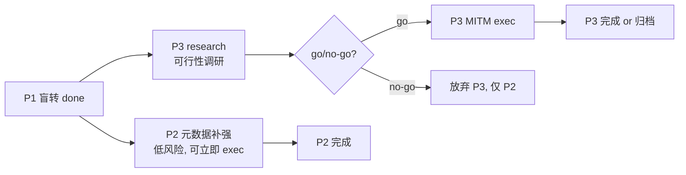

# proxy-http-relay — /proxy 通用 HTTP 代理 + 规则复用

- **Status**: P1 已完成（CONNECT 盲转隧道 + 元数据 + 无平台筛选）；P2 规划中；P3 调研中
- **Source**: session:claude_96a0dd46-757b-40db-a9f7-4555767078d3
- **Spec**: `.trellis/spec/backend/proxy-connect-relay.md`
- **Research**:
  - `research/p2-middleware-reuse.md`（P2 现状矩阵 + 方案）
  - `research/mitm-feasibility.md`（P3 可行性，pending）

---

## 背景

用户诉求：确保 `/proxy` 路径下代理转发规则、中间件等规则，在**环境变量代理方案**（客户端经 `HTTP_PROXY`/`HTTPS_PROXY` 指向 aidog）下依旧生效，且**复用代码而非两套逻辑**。

环境变量代理方案 = 客户端发 `CONNECT host:port` 建 TCP 隧道 → 隧道内流量 TLS 加密 → aidog P1 盲转密文字节。

## 核心约束（research 实证）

CONNECT 盲转隧道层**原理上不可能**让基于 HTTP body/path 的规则生效（TLS 不解密，无明文）：
- middleware engine（context_management strip / 脱敏 / 注入）— 作用对象是解析后的 ChatRequest 文本
- router 平台选择 + 模型映射 — 无 apikey（在 TLS 加密层内）+ 无 model
- headers 转换 — 不能往加密流塞明文头，会破 TLS 握手
- retry 候选遍历 — 单 TCP 隧道绑定一个 target，无"换候选重发"对象

要让上述核心规则真生效，唯一路径 = **P3 MITM 解密 TLS**。

---

## P2 — CONNECT 元数据记账对齐（不破盲转）

> 大前提：P2 不碰 body，只把 CONNECT 的元数据记账（host/状态/延迟/熔断）对齐 AI 路径，让平台健康度/日志一致性更好。**不让 middleware 等核心规则生效**（那归 P3）。

### 范围（4 子项，均复用现有函数）

| 子项 | 复用点 | 方案 | 风险/缓解 |
|---|---|---|---|
| **A. timeout 级联** | `timeout.rs:14` `resolve_timeout` + `get_system_timeout` | CONNECT 裸 `TcpStream::connect` 套 `tokio::time::timeout(conn_timeout, ...)`；CONNECT 无 apikey 只能 system 级 | 隧道建后 idle 超时需大值（5min）或仅 connect 阶段超时，避长连接（SSE/WebSocket over TLS）误杀 |
| **B. 熔断失败计数** | `scheduling.rs:154` `inc_inflight` / `:181` `record_failure` | host 命中平台 → connect 前 `inc_inflight`；TCP 失败 → `record_failure` | **`record_success` 传 latency=0 或不调**，避 CONNECT TCP 握手延迟（ms）污染 LeastLatency EMA（AI 推理秒级）|
| **C. last_error（仅失败侧）** | `db::set_platform_last_error`（`forward.rs:309`） | CONNECT TCP 失败 → `set_platform_last_error` | **禁补 `recover_platform_auto_disabled`（成功侧）**：CONNECT 隧道成功 ≠ 平台 AI API 健康（隧道内可能非 AI 流量），误恢复坏平台 |
| **D. tracing span 对齐** | `handler.rs:13` `info_span!("req", ...)` | `handle_proxy_core:84` CONNECT 分流前把 `request_id` 传入 `handle_connect`，instrument 同款 span | 改 `handle_connect` 签名收 request_id |

### 不做（spec 锁定 / 原理不可能）

- middleware / 路由 / headers / retry — 原理不可能（P3 范畴）
- cost 估算（`spawn_estimate`）— spec MUST：CONNECT 0 token 0 cost
- agg 统计（`upsert_stats_agg`）— spec MUST：隧道流量非 AI 请求，禁入统计（`upsert_connect_log` 独立路径）
- `recover_platform_auto_disabled`（成功侧）— 误恢复风险

### 验证

```bash
cd src-tauri
cargo test connect -- --nocapture           # 现有 5 测试不回归
cargo clippy                                # warning 必清
# 新增测试：connect_timeout_applied / connect_failure_records_breaker / connect_failure_sets_last_error
grep -n "resolve_timeout\|inc_inflight\|record_failure\|set_platform_last_error" src/gateway/proxy/connect.rs  # 4 复用点接入
```

---

## P3 — MITM 解密 TLS（待 research 回填）

> 目标：让 middleware/路由/headers/retry 在环境变量代理下真正生效。pending `research/mitm-feasibility.md`。

### 待定（research 回来后填）

- 技术选型（rustls + rcgen + tokio-rustls）
- 客户端信任成本（假 CA 装系统/浏览器信任库）
- TLS 指纹 / pinned cert 风险（Claude Code CLI / Codex 是否拒）
- 与 forward_attempt 链复用点（解密后明文如何灌进，复用 vs 新写）
- 白名单策略（仅 AI 平台 host MITM，其余盲转）
- go / no-go 推荐 + 工作量

---

## 调度图



- P2 与 P3 文件域交（都改 connect.rs）→ **串行**：P2 先（低风险立即做），P3 待 research + grill 后再启
- P2 exec 需建 proxy-http-relay worktree（task.py start 已切 current，worktree 待建）
