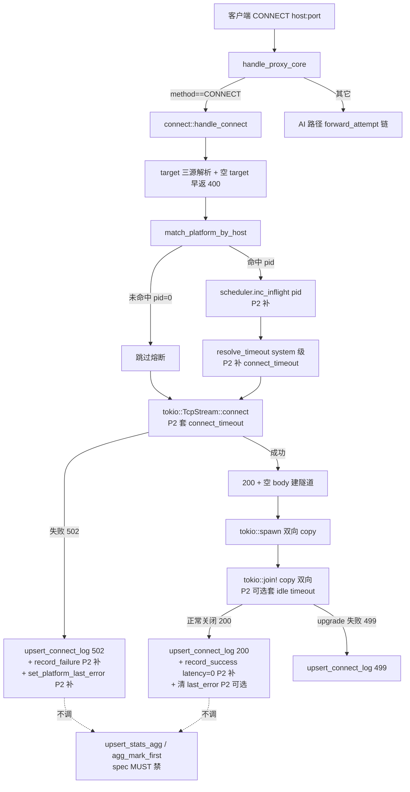

# Research: P2 CONNECT 隧道 — 中间件/转发规则复用现状与方案

- **Query**: CONNECT 隧道当前复用了哪些 `/proxy` HTTP 路径的规则/中间件，哪些没复用，P2 如何最大化复用而非两套逻辑
- **Scope**: internal（codebase 证据为主）
- **Date**: 2026-07-03
- **Spec 引用**: `.trellis/spec/backend/proxy-connect-relay.md`（P1 契约）

---

## TL;DR（结论先行）

CONNECT 是 **TCP 盲转隧道**，TLS 不解密。P1 设计本质上把所有「基于 HTTP body/path/model 的规则」挡在隧道层之外——这不是遗漏，是原理必然。P1 已接入的规则只有 4 条（host 平台匹配 / 日志总开关 / 独立 proxy_log 落库 / 终态终态码 502/499/200），**其余全部未接入**。P2 能在不破坏盲转的前提下「补」的规则也很有限（主要是日志/熔断的元数据维度），核心 AI 规则（middleware 内容过滤 / 路由模型映射 / retry / headers 转换 / cost 估算）**原理上不可能在隧道层接入**——要在环境变量代理方案下让它们生效，唯一路径是 P3 MITM 解密，而非 P2 复用。

---

## 1. CONNECT vs AI 请求生命周期对照表

| 阶段 | AI 请求（`handle_proxy_core` → `forward_attempt`） | CONNECT（`handle_connect`） | 共享函数 / 分叉 |
|---|---|---|---|
| 入口分流 | `handler.rs:84` 早返前 | `handler.rs:84` `if req.method()==CONNECT { return connect::handle_connect(...) }` | **分叉点**：CONNECT 在此 early return，**不进入** `handle_proxy_core` 后续任何逻辑 |
| request_id 生成 | `handler.rs:10` `uuid::Uuid::new_v4()` | `connect.rs:61`（CONNECT 自己生成，未复用 handle_proxy 的 span） | 各自独立（CONNECT 不挂 `req` span，tracing 串联回归弱） |
| Drop guard（499 兜底） | `handler.rs:23-56` `RequestLogGuard` → `finalize_incomplete_proxy_log` | **无**（CONNECT 在 spawn task 内自管日志，不走 guard） | 分叉（见下方风险 §5） |
| target 解析 | `handler.rs:151-163`（auth header + `req.uri().path()`） | `connect.rs:31-50`（path/authority/Host 三源取 + 空 target 早返 400） | **分叉**：CONNECT 用 authority-form URI，AI 用 path |
| 请求体读取 | `handler.rs:176-187` `axum::body::to_bytes(body, 10MB)` | **不读 body**（隧道层看不到，TLS 加密） | 不复用（原理不可能） |
| 模型提取 | `handler.rs:191-195`（`body.model` JSON 字段） | **无**（无 body） | 不复用 |
| 模型列表端点分流 | `handler.rs:204-206` `handle_models_static` | **无**（CONNECT 非 GET，且 path 是 authority-form） | 不复用 |
| 分组解析（apikey） | `handler.rs:209-228` `resolve_group`（按 Authorization Bearer / x-api-key） | **无**（HTTPS 未解密，无 apikey 可读；仅 host 级匹配） | 分叉：CONNECT 用 `match_platform_by_host`（`endpoint.rs:201`） |
| 协议探测 | `handler.rs:233` `detect_source_protocol(&path)` | **无**（固定 `source_protocol="http-connect"`） | 不复用 |
| 子端点分流（responses/count_tokens） | `handler.rs:244-258` | **无** | 不复用 |
| 入站请求解析 | `handler.rs:261-280` `adapter::parse_incoming_request` | **无**（无 body） | 不复用 |
| **中间件入站规则（global/group）** | `handler.rs:290-297` `state.middleware.apply_inbound(...)` | **无** | **未接入**（见 §2） |
| 路由候选选择 | `handler.rs:299-329` `select_candidates_ctx`（调度+熔断+sticky+模型映射） | **无**（host 命中即记 platform_id，不选候选、不调度） | **未接入** |
| Mock / ClaudeCode 透传分流 | `handler.rs:335-375` | **无** | 不复用 |
| **重试编排** | `handler.rs:382-421` for-loop `forward_attempt`（按 max_retries 遍历候选） | **无**（TCP 连接失败即 502 终态，无候选切换） | **未接入** |
| `forward_attempt`（单次上游尝试） | `forward.rs:12-514` | **无**（CONNECT 直接 `TcpStream::connect`） | **未接入** |
| 平台端点选择（协议匹配） | `forward.rs:41` `select_endpoint_for_protocol` | **无**（host 命中即转发，不按协议选端点） | 不复用 |
| 同协议透传判定 | `forward.rs:92-95` `same_protocol_passthrough` | **无** | 不复用 |
| max_tokens 裁剪 | `forward.rs:117-131` `router::cap_max_tokens` | **无**（无 body） | 不复用 |
| **中间件入站规则（platform 层）** | `forward.rs:137-147` `apply_inbound_platform` | **无** | **未接入** |
| 手动预算阻断 | `forward.rs:152-202` `manual_budget::evaluate_depletion` | **无** | **未接入** |
| 协议转换 | `forward.rs:209-220` `adapter::convert_request` / 透传 patch model | **无**（无 body） | 不复用 |
| Coding Plan 字段注入 | `forward.rs:223-226` `inject_coding_plan_fields` | **无** | 不复用 |
| 第三方 anthropic 字段剔除 | `forward.rs:243-248` `strip_thinking_if_unmatched` / `hoist_mid_messages_system` | **无** | 不复用 |
| 超时解析 | `forward.rs:253-258` `resolve_timeout`（model>group>system 三级） | **无**（裸 `TcpStream::connect`，无超时配置） | **未接入**（可补，见 §4） |
| HTTP client 构建 | `forward.rs:259-262` `http_client::build_http_client` | **无**（裸 TCP，不用 reqwest） | 不复用 |
| 上游请求头构建 | `forward.rs:268` `build_upstream_headers` + `passthrough_convert_headers` | **无**（隧道透传客户端原始 TLS 字节，aidog 不构造任何 HTTP 头） | 不复用（原理不可能，见 §3） |
| 鉴权注入 | `forward.rs:277` `apply_client_headers`（Bearer/x-api-key） | **无**（无平台 apikey，CONNECT target host 直连） | 不复用 |
| **熔断 in-flight +1** | `forward.rs:292` `state.scheduler.inc_inflight` | **无** | **未接入**（可补，见 §4） |
| 上游请求发送 | `forward.rs:294` `req_builder.send()` | `connect.rs:65` `tokio::net::TcpStream::connect(&target)` | **分叉**：AI 用 reqwest HTTP，CONNECT 用 tokio 裸 TCP |
| 上游错误处理 | `forward.rs:296-326`（502 + record_failure + set_platform_last_error） | `connect.rs:67-76`（502 + `upsert_connect_log`，**无 record_failure / 无 set_platform_last_error**） | 分叉：错误记账路径独立 |
| 流式 peek 决策 B | `forward.rs:461-513` `classify_stream_first` | **无**（裸字节流，无 SSE 概念） | 不复用 |
| 2xx 成功记账 | `forward.rs:410-438` `commit_2xx_success!`（record_success + 恢复 auto_disabled + 清 last_error） | `connect.rs:143-148`（仅 `upsert_connect_log` status=200） | **分叉**：CONNECT 不更新熔断 EMA、不恢复 auto_disabled |
| 响应头透传 | `retry.rs:32-54` `filter_upstream_resp_headers` | **无**（隧道盲转字节，aidog 不解析响应头） | 不复用 |
| **日志落库** | `log.rs:16-163` `upsert_log`（含 stats_agg 聚合 + est_cost + 渐进式 diff） | `log.rs:277-331` `upsert_connect_log`（独立路径，直 INSERT，0 token 0 cost，无 stats_agg） | **分叉**：P1 故意独立，防 stats 污染（spec MUST） |
| 成本估算 | `log.rs:216-262` `spawn_estimate`（余额/coding plan 配额更新） | **无**（0 token，无意义） | 不复用 |
| 终态响应 | `finish.rs`（finish_nonstream / finish_stream） | `connect.rs:80-83` `Response::builder().status(200).body(Body::empty())` | **分叉**：CONNECT 固定 200 + 空 body（spec MUST，禁 Connection: upgrade） |
| 双向转发 | （AI 单向请求-响应） | `connect.rs:133-140` `tokio::io::copy` × 2 + `tokio::join!` | CONNECT 独有（TCP 双向隧道） |

---

## 2. 规则复用现状矩阵

| 规则 | CONNECT 接入? | 复用点 (file:line) | 未接入原因 | 可否 P2 接入 |
|---|---|---|---|---|
| **middleware engine 入站（内容过滤/脱敏/注入）** | ❌ | — | 中间件作用对象是 `ChatRequest`（解析后的 messages/system 文本），CONNECT 隧道无 body 可解析，TLS 加密看不到明文 | **原理不可能**（§3） |
| middleware engine 出站（error classify/override） | ❌ | — | 同上，且无上游响应体可改写 | 原理不可能 |
| **router 平台选择（候选列表 + 排序）** | ❌ | — | 路由按 `group_key`（apikey）+ 模型映射；CONNECT 无 apikey（TLS 未解密）+ 无 model | **原理不可能**（§3） |
| **router 模型映射（model_mapping）** | ❌ | — | 无 body.model 字段 | 原理不可能 |
| max_tokens 裁剪 | ❌ | — | 无 body | 原理不可能 |
| **retry 重试编排（候选遍历）** | ❌ | — | CONNECT 是单 TCP 流，无「换候选」语义；上游断 = 隧道断，客户端自重连 | 不适用（语义不符） |
| **headers 转换（build_upstream_headers / apply_client_headers / passthrough_convert_headers）** | ❌ | — | CONNECT 透传客户端 TLS 握手 + 加密 HTTP 字节，aidog 不能/不应构造任何明文 HTTP 头 | 原理不可能（§3） |
| 第三方 anthropic 字段剔除 | ❌ | — | 无 body | 原理不可能 |
| Coding Plan 字段注入 | ❌ | — | 无 body | 原理不可能 |
| 手动预算阻断（manual_budget） | ❌ | — | 无 platform 候选选定（仅 host 标记，不真正「用」平台） | 可补（host 命中平台 → 查 manual_budgets 判余额，见 §4） |
| 同协议透传判定 | ❌ | — | 无协议概念 | 原理不可能 |
| **log settings 3 级（enabled / log_user / log_upstream）** | ⚠️ 部分 | `connect.rs:58-59` 仅读 `settings.enabled`（总开关） | CONNECT body 本就全空，log_user/log_upstream 的 strip 语义无对象 | 不需要（body 空，strip 无意义；总开关已复用） |
| **retention 清理（3 级 retention_days）** | ✅ 隐式复用 | `db/proxy_log.rs:489` `cleanup_proxy_logs` + `db/maintenance.rs:127,154` 两个字段清理 | 三条 cleanup SQL 均按 `created_at` 时间过滤，**无 protocol 过滤**，http-connect 行被同等清理 | 已复用（无需动） |
| **timeout 级联（model>group>system）** | ❌ | — | 裸 `TcpStream::connect` 无超时参数 | **可补**（§4：给 TcpStream::connect 套 connect_timeout + 隧道 idle 超时） |
| **scheduler 熔断（breaker 三态）** | ❌ | — | 未调 inc_inflight/record_success/record_failure | **可补**（§4：host 命中平台 → inc/record，但语义需斟酌） |
| scheduler 延迟 EMA（LeastLatency 排序） | ❌ | — | 同上 | 可补（与熔断同路径，但 CONNECT 延迟≠AI 延迟，会污染 EMA） |
| scheduler sticky 绑定 | ❌ | — | 无 group_key 可拼 session | 原理不可能 |
| **estimate cost（spawn_estimate）** | ❌ | — | 0 token，无成本可估；CONNECT 不计费（spec MUST） | 不需要（spec 锁定 0 cost） |
| **agg 统计（upsert_stats_agg）** | ❌ 故意 | `log.rs:30-34` `agg_mark_first` 在 `upsert_log` 内；`upsert_connect_log` 直 INSERT 绕开 | spec MUST：隧道流量非 AI 请求，不该进 AI 统计 | **不可补**（spec 锁定，补了即污染统计） |
| platform host 匹配 | ✅ | `endpoint.rs:201` `match_platform_by_host`（复用 `endpoint_host`） | — | 已接入 |
| 平台 last_error 记录 | ❌ | — | CONNECT 上游失败未调 `set_platform_last_error`（`forward.rs:309` 有） | 可补（§4） |
| 平台 auto_disabled 恢复 | ❌ | — | CONNECT 成功未调 `recover_platform_auto_disabled`（`forward.rs:427` 有） | 可补（但语义存疑，§5） |

---

## 3. 不可复用项（原理上不可能，不是「难」）

CONNECT 隧道的根本约束：**客户端经 `http_proxy` 指向 aidog 后，发的 CONNECT 请求建立的是 TCP 隧道，隧道内所有应用层流量（HTTP 请求行/头/body）都被 TLS 加密**。aidog 在 P1 盲转语义下，`tokio::io::copy` 双向搬运的是**密文字节流**，不是明文 HTTP 报文。

### 3.1 middleware engine（内容过滤/脱敏/注入）— 原理不可能

- **作用对象**：`ChatRequest` 结构（`adapter/types`），由 `adapter::parse_incoming_request` 从**明文 JSON body** 解析出 messages/system 文本（`middleware/inbound.rs:156-181` `collect_request_text`）。
- **CONNECT 看到的**：TLS 密文字节流。无法解析为 JSON，无法提取 messages，无法做 regex/contains 匹配。
- **理据**：要让 middleware 生效，必须先拿到明文 HTTP body → 必须 MITM 解密 TLS（生成假 CA、客户端装信任、SNI 劫持）。这是 P3 范畴，不是 P2「复用」能解决的。

### 3.2 router 平台选择 + 模型映射 — 原理不可能

- **路由输入**：`group_key`（Authorization Bearer apikey，`endpoint.rs:148` `resolve_group`）+ `chat_req.model`（`router/candidates.rs:51` `group.model_mappings.find(source_model)`）。
- **CONNECT 缺什么**：① 鉴权头在 TLS 加密层内（CONNECT 请求本身只有 `CONNECT host:port HTTP/1.1` + Host header，无 Authorization）；② 无 model 字段。
- **P1 替代**：`match_platform_by_host`（`endpoint.rs:201`）只按 target host 匹配平台，是「标记」不是「路由」——不选候选、不计费、不入调度。这是 host 级 metadata 关联，与 apikey+model 的真路由**语义完全不同**。

### 3.3 headers 转换（build_upstream_headers / apply_client_headers）— 原理不可能

- **AI 路径**：aidog 用 reqwest 重建明文 HTTP 请求，覆盖 UA/auth/CT，透传 anthropic-* / x-stainless-* 等（`headers.rs:118-144` `apply_client_headers`）。
- **CONNECT 路径**：隧道透传的是客户端 TLS ClientHello + 后续加密应用数据。aidog **看不到明文头**，也无法「构造」客户端请求头塞进加密流（会破坏 TLS 记录层，握手失败）。
- **即使 P3 MITM**：CONNECT 是任意 host 的通用隧道（不像 `/proxy/v1/messages` 固定走 AI 平台），aidog 无法预知隧道内是哪个上游、该注入哪个平台 apikey。headers 转换的前提是「已知目标平台」，CONNECT 通用隧道不满足。

### 3.4 retry 重试编排 — 语义不符（非原理不可能，但语义错位）

- AI retry 的语义：上游 5xx/超时 → 换下个候选平台重发**同一个 AI 请求**。
- CONNECT 的语义：一条 TCP 隧道绑定**一个** target host:port。上游 TCP 断开 = 隧道关闭 = 客户端 TLS 会话终结，**没有「换候选重发」的对象**（客户端会自己重连，不是代理职责）。
- 即使强行 retry，也无法在隧道层「重放」客户端已发的加密数据（aidog 没有明文）。

### 3.5 cost 估算 + agg 统计 — spec 锁定，不该接入

- spec MUST（`proxy-connect-relay.md:49-55`）：`upsert_connect_log` 独立路径，`tokens=0` / `cost=0`，**禁调 upsert_log / agg_mark_first / upsert_stats_agg**。
- 理据：隧道流量非 AI 请求，计入统计会污染 Stats 页/托盘成本。这是 P1 实证决策，非原理限制，但 spec 锁定 = 不可补。

---

## 4. P2 复用方案（仅限不破坏盲转语义的元数据维度）

> **大前提**：P2 不能让 §3 列出的核心 AI 规则在隧道层「生效」——那是 P3 MITM 的活。P2 能做的只是把 CONNECT 的**元数据记账**（host/状态/延迟/熔断）对齐 AI 路径，让平台健康度/日志一致性更好，而非「让 middleware 在环境变量代理下生效」（该诉求需 P3）。

### 4.1 可补项（低风险，复用现有函数）

#### A. timeout 级联（复用 `resolve_timeout`）

CONNECT 裸 `TcpStream::connect` 无超时（`connect.rs:65`）。可补 connect 阶段超时：

```rust
// connect.rs 复用 forward.rs:253-254 的解析逻辑
// 但 CONNECT 无 group/model_mapping（无 apikey），只能退化为 system 级：
let system_timeout = get_system_timeout(&state.db).await;
let (_req_timeout, conn_timeout) = resolve_timeout(&None, &/* placeholder group */, &system_timeout);
// 给 TcpStream::connect 套 tokio::time::timeout(conn_timeout, ...)
```

- **复用点**：`timeout.rs:14` `resolve_timeout` + `timeout.rs:4` `get_system_timeout`。
- **限制**：CONNECT 无 group/model_mapping 输入（无 apikey 解析 group），只能用 system 级默认。要补 group 级需先解密拿 apikey（P3）。
- **盲转安全**：✅ connect 阶段超时只影响 TCP 握手，不碰隧道字节流。**隧道建后的 idle 超时**需另加（`tokio::time::timeout` 包 `tokio::join!`），但要小心长连接（如 SSE/ WebSocket over TLS）被误杀。

#### B. 熔断指标记录（复用 `scheduler.inc_inflight` / `record_success` / `record_failure`）

CONNECT host 命中平台时（`match_platform_by_host` 返 Some），可把该平台的熔断指标对齐 AI 路径：

```rust
// connect.rs 在 match_platform_by_host 命中后、TcpStream::connect 前：
if let Some(pid) = platform_id_from_host {
    state.scheduler.inc_inflight(pid as u64);
}
// TCP connect 失败 → record_failure（复用 forward.rs:299）
// 隧道正常关闭 → record_success(latency_ms)（复用 forward.rs:414）
```

- **复用点**：`scheduling.rs:154` `inc_inflight` / `scheduling.rs:165` `record_success` / `scheduling.rs:181` `record_failure`。阈值解析复用 `sched_settings.effective_thresholds`（`forward.rs:289`）。
- **风险（§5）**：CONNECT 延迟 ≠ AI 请求延迟（TCP 握手 vs 完整推理），计入 EMA 会污染 LeastLatency 排序。建议 `record_success` 传 latency=0 或单独标记，不污染 EMA；仅用 breaker 失败计数。
- **未命中平台（platform_id=0）**：跳过熔断（无平台可挂）。

#### C. 平台 last_error / auto_disabled 恢复（复用 `set_platform_last_error` / `recover_platform_auto_disabled`）

CONNECT 上游 TCP 失败时，AI 路径会 `set_platform_last_error`（`forward.rs:309`）；成功会清 last_error + 恢复 auto_disabled（`forward.rs:416-433`）。CONNECT 当前都不做。

- **复用点**：`db::set_platform_last_error`（`forward.rs:309`）/ `db::recover_platform_auto_disabled`（`forward.rs:428`）。
- **风险（§5）**：语义存疑——CONNECT 隧道成功只代表 TCP 通，不代表平台 API 健康（隧道内可能是任意非 AI 流量）。用 CONNECT 成功去恢复 AI 路径的 auto_disabled 平台，可能误恢复。

#### D. tracing span 对齐（复用 `req` span）

CONNECT 当前不挂 `req{trace_id, request_id}` span（`handler.rs:13`），子日志行无法串回 proxy_log.id。可在 `handle_proxy_core:84` CONNECT 分流前，把已生成的 `request_id` 传入 `handle_connect` 并 instrument 同款 span。

- **复用点**：`handler.rs:13` `tracing::info_span!("req", ...)`。
- **当前分叉**：`handle_connect` 签名未收 request_id（`connect.rs:26`），需改签名或 connect 内自生成（现状）。

### 4.2 调度图（CONNECT 补强后的请求流）



---

## 5. 风险

| 风险 | 说明 | 缓解 |
|---|---|---|
| **接入 middleware 可能破盲转** | 若 P2 误把 `apply_inbound` 接入 CONNECT，会因无 ChatRequest 而 panic / 强行解密破坏 TLS。 | §3.1 已明示原理不可能；P2 方案 §4 仅补元数据，不碰 body。 |
| **熔断 EMA 污染** | CONNECT TCP 握手延迟（ms 级）远小于 AI 推理（秒级），计入 `record_success(latency)` 会让 LeastLatency 排序偏向「CONNECT 频繁命中」的平台。 | `record_success` 传 latency=0 或新增 `record_connect_success`（不更新 EMA），仅用 breaker 计数。 |
| **stats 污染（已防）** | 若误把 CONNECT 走 `upsert_log` 而非 `upsert_connect_log`，会触发 `agg_mark_first` + `upsert_stats_agg`，Stats/托盘虚高。 | spec MUST 锁定 `upsert_connect_log` 独立路径；`test_connect.rs:60` 有不变量测试。 |
| **auto_disabled 误恢复** | CONNECT 隧道成功 ≠ 平台 AI API 健康（隧道内可能是浏览器访问平台官网等无关流量）。用 CONNECT 成功调 `recover_platform_auto_disabled` 可能误恢复坏平台。 | §4.1-C 建议仅补 `set_platform_last_error`（失败侧），**不补** `recover_platform_auto_disabled`（成功侧），避免误恢复。 |
| **长连接被 idle timeout 误杀** | CONNECT 隧道承载 SSE/WebSocket over TLS 时，长 idle 是正常的；套 idle timeout 会断合法长连接。 | §4.1-A 的隧道 idle timeout 设较大值（如 5min）或仅做 connect 阶段超时，不动建后隧道。 |
| **Drop guard 缺失** | CONNECT 不挂 `RequestLogGuard`，若 spawn task 内 future 被 drop（非正常返回），proxy_log 行可能卡 status_code=0。 | CONNECT 在 spawn task 内每个分支都显式 `upsert_connect_log`（`connect.rs:69/92/118/143`），不走 guard；但 upgrade await 失败前若 task 被 kill，仍有窗口。可补 guard（需把 499 语义适配 CONNECT）。 |
| **tracing 串联弱** | CONNECT 不挂 `req` span，DB 内 proxy_log.id 无法从 stderr 日志行串回（AI 路径可串）。 | §4.1-D 补 span 对齐。 |

---

## 关键文件路径（供 main 引用）

- `/Users/luoxin/persons/lyxamour/aidog/src-tauri/src/gateway/proxy/connect.rs` — CONNECT handler 主体
- `/Users/luoxin/persons/lyxamour/aidog/src-tauri/src/gateway/proxy/handler.rs:84` — CONNECT 分流 early return
- `/Users/luoxin/persons/lyxamour/aidog/src-tauri/src/gateway/proxy/log.rs:277` — `upsert_connect_log` 独立路径
- `/Users/luoxin/persons/lyxamour/aidog/src-tauri/src/gateway/proxy/endpoint.rs:201` — `match_platform_by_host`（唯一已接入的复用）
- `/Users/luoxin/persons/lyxamour/aidog/src-tauri/src/gateway/middleware/mod.rs` + `inbound.rs` — middleware engine（CONNECT 未接入，原理不可能）
- `/Users/luoxin/persons/lyxamour/aidog/src-tauri/src/gateway/proxy/forward.rs` — AI `forward_attempt` 链（CONNECT 全部未接入）
- `/Users/luoxin/persons/lyxamour/aidog/src-tauri/src/gateway/scheduling.rs` — 熔断/sticky（CONNECT 未接入，P2 可补元数据）
- `/Users/luoxin/persons/lyxamour/aidog/src-tauri/src/gateway/router/candidates.rs:45` — `select_candidates_ctx`（CONNECT 未接入，原理不可能）
- `/Users/luoxin/persons/lyxamour/aidog/src-tauri/src/gateway/proxy/timeout.rs:14` — `resolve_timeout`（CONNECT 未接入，P2 可补 system 级）
- `/Users/luoxin/persons/lyxamour/aidog/.trellis/spec/backend/proxy-connect-relay.md` — P1 契约

## Caveats / 需要

- **需要（转达用户）**：用户诉求「确保 `/proxy` 路径下代理转发规则、中间件等规则，在环境变量代理方案下依旧生效」——**经证据确认，middleware engine / 路由模型映射 / headers 转换 / retry 等核心规则在 P1/P2 CONNECT 盲转隧道层原理上不可能生效**（§3）。要让它们在环境变量代理方案下生效，唯一路径是 **P3 MITM 解密 TLS**（生成假 CA + 客户端信任 + SNI 劫持 + 明文重放），这超出 P2「复用」范畴。请用户确认是否接受此结论，或是否要启动 P3 MITM 调研。
- scheduler.rs 单文件即熔断+sticky 全部逻辑（非目录），已确认无 `scheduling/` 子目录。
- retention cleanup 三条 SQL（`cleanup_proxy_logs` / `cleanup_user_request_fields` / `cleanup_upstream_request_fields`）均无 protocol 过滤，http-connect 行被同等清理（body 已空，清理无副作用）。已确认这是「隐式复用」而非遗漏。
