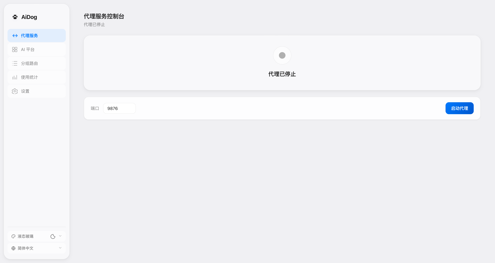
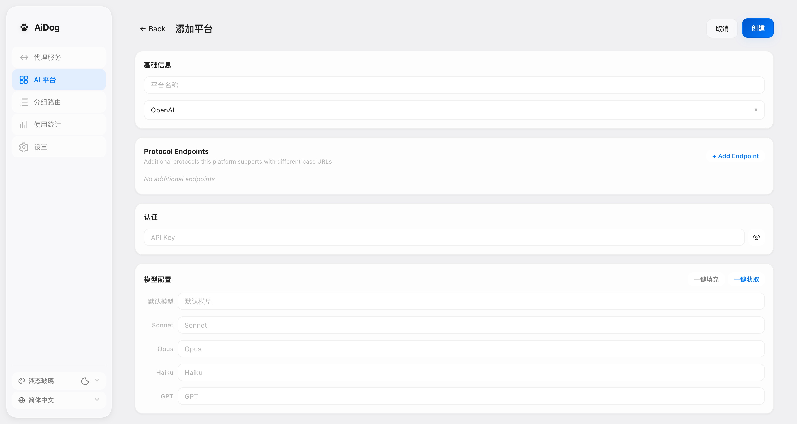
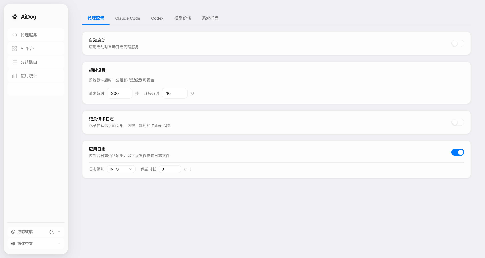

<div align="center">

# 🐕 AiDog

**Unified AI API Gateway**

Desktop app · No cloud · 50+ platforms in one place · Smart routing · Usage analytics

[](https://lazygophers.github.io/aidog/en/)
[](https://github.com/lazygophers/aidog/releases/latest)
[](#license)
[](https://github.com/lazygophers/aidog/releases/latest)
[](https://linux.do)
[](https://github.com/lazygophers/aidog/stargazers)
[](https://github.com/lazygophers/aidog/releases)
[](https://github.com/lazygophers/aidog/commits)
[](https://github.com/lazygophers/aidog/issues)
[](https://github.com/lazygophers/aidog/pulls)

[简体中文](README.md) · `English` · [Français](README.fr.md) · [Deutsch](README.de.md) · [Русский](README.ru.md) · [العربية](README.ar.md) · [Español](README.es.md) · [日本語](README.ja.md)

</div>

---

> 📖 **Full documentation**: <https://lazygophers.github.io/aidog/en/>

AiDog is a Tauri-based **desktop AI API gateway**. It unifies the management, routing, and monitoring of requests across 50+ AI platforms — consolidating scattered API keys, model mappings, load balancing, usage analytics, and coding-assistant configuration into a single app. No backend service, no cloud; all data stays in a local SQLite database.



## What it solves

| Your pain | How AiDog handles it |
| --- | --- |
| API keys scattered across a dozen platforms, painful to switch | **Multi-platform aggregation** — 50+ platform presets, manage every key in one place |
| One platform goes down and your whole flow stalls | **Failover + load balancing** — auto-retry, circuit breaking, scheduling across platforms |
| Claude Code / Codex / each client configured separately | **Native coding-assistant integration** — one-click config export, all traffic via the proxy |
| No idea how much you spend each month or which platform is about to run out | **Usage monitoring** — tokens + cost estimation + balance + Coding Plan quota |
| Don't want your data in the cloud or in third-party hands | **Pure local** — proxy + database on your machine, zero exfiltration |

## Core features

### 🌐 Gateway & routing
- **Multi-platform aggregation** — 50+ platform presets (Anthropic / OpenAI / DeepSeek / GLM / Kimi / MiniMax / Qwen / SiliconFlow / OpenRouter, etc.), one-click setup
- **Smart grouping** — match requests by Bearer token / path; Failover and Load Balance
- **Model mapping** — transparent model name substitution (e.g. `claude-sonnet-4` → `deepseek-chat`)
- **Protocol conversion** — bidirectional between OpenAI Chat / Completions / Responses, Anthropic, and Gemini protocols
- **Circuit breaking & scheduling** — auto-break abnormal platforms, tri-state management, exponential backoff, in-group smart scheduling
- **Middleware rule engine** — inbound/outbound rules: normalize, override, redact, inject, filter sensitive words, detect errors, with built-in presets

### 📊 Monitoring & stats
- **Usage monitoring** — token stats, cost estimation (auto price sync + manual budget)
- **Balance queries** — pull each platform's balance in real time
- **Coding Plan quota** — DeepSeek / Kimi / GLM Coding Plan quota display and countdown
- **Request logs** — three-level granularity (user original request / upstream request / summary), each with its own toggle and retention

### 🤖 Coding-assistant integration
- **Claude Code** — native integration: config editing, one-click import/export, StatusLine scripts, Hooks, per-group config sync
- **OpenAI Codex** — native integration: `~/.codex/config.toml` editor, Responses API auto-routing
- **MCP management** — centralized DB storage + per-agent enable toggle + scan-and-import + sensitive-field masking
- **Skills management** — npx-based unified cross-platform skills list + per-item enable toggle
- **System notifications** — TTS announcements / popup / inbox + Claude Code/Codex hook one-click injection

### 🎨 Personalization
- **Theme system** — 3 axes: 9 styles (Liquid Glass / Flat / Soft / Sharp / Aurora / Paper / Terminal / Bento / Sketchy) × 12 named palettes (Apple Blue / Nord / Dracula / Catppuccin / Gruvbox / Tokyo Night / One Dark / Material / GitHub / Night Owl, etc.) × light/dark modes
- **Internationalization** — 8 languages (incl. Arabic RTL)
- **Import & export** — AES-256-GCM encrypted single-file container `.aidogx`, 7 scopes with per-item conflict resolution
- **Tray + status bar** — quick actions from the system tray + customizable status bar scripts (Python + uv)

## Installation

### System requirements

| OS | Minimum version | Notes |
| --- | --- | --- |
| macOS | 12.0 (Monterey) | Intel + Apple Silicon |
| Windows | Windows 10 | x64 |
| Linux | x86_64 / aarch64 | Requires WebKit2GTK |

**Download** 👉 <https://github.com/lazygophers/aidog/releases/latest>

### macOS

1. Download the `.dmg` from [Releases Latest](https://github.com/lazygophers/aidog/releases/latest)
2. Double-click to open, drag **AiDog** into the `Applications` folder
3. On first launch, **right-click** the app → select "Open" (bypass Gatekeeper — the app is unsigned)

> ⚠️ If first launch shows "cannot verify developer", go to `System Settings → Privacy & Security → Open Anyway`.

### Windows

1. Download the `.msi` installer from [Releases Latest](https://github.com/lazygophers/aidog/releases/latest)
2. Double-click the installer and follow the prompts
3. If SmartScreen blocks it, click "More info → Run anyway"

### Linux

```bash
# DEB package
sudo dpkg -i aidog_0.1.0_amd64.deb

# Or AppImage
chmod +x aidog_0.1.0_amd64.AppImage
./aidog_0.1.0_amd64.AppImage
```

> Linux requires the WebKit2GTK dependency first: `sudo apt install libwebkit2gtk-4.1-dev` (Debian/Ubuntu).

### First launch

After installing, launch AiDog and it will automatically:

1. Start the local proxy server (default `http://127.0.0.1:9876`)
2. Create the local SQLite database (`~/.aidog/aidog.db`)
3. Show the main UI and guide you to add your first platform

## Quick start (3 steps)

### Step 1: Add a platform



1. Click **"Platforms"** in the left navigation
2. Click **"+ Add platform"**
3. Fill in: **Name** (e.g. `My OpenAI`), **Base URL** (e.g. `https://api.openai.com/v1`, including the `/v1` version prefix), **API Key**
4. Save

> 💡 The Base URL already includes the version prefix; AiDog appends `/chat/completions` automatically — no need to stitch the path by hand.

### Step 2: Point the client at the proxy

In the app that consumes AI APIs, change the API address to the AiDog proxy address:

```
http://127.0.0.1:9876/proxy/v1
```

The API key can be **any value** — AiDog forwards using your configured real key.

### Step 3: Verify

```bash
curl http://127.0.0.1:9876/proxy/v1/chat/completions \
  -H "Content-Type: application/json" \
  -H "Authorization: Bearer any-value" \
  -d '{"model": "gpt-4o", "messages": [{"role": "user", "content": "Hello!"}]}'
```

A normal AI response means setup is complete. Requests are routed, metered, and logged automatically.

## Client integration in depth

### Claude Code

AiDog provides full integration in **"Settings → Claude Code"** (edit model/permissions/sandbox/plugins/Hooks/StatusLine, one-click import/export).

**Option 1: Environment variables (fastest)**

```bash
export ANTHROPIC_BASE_URL="http://127.0.0.1:9876"
export ANTHROPIC_API_KEY="any-value"
claude
```

**Option 2: One-click config export**

Click "Export to Claude Code" in "Settings → Claude Code" and AiDog writes `~/.claude.json`:

```json
{ "apiBaseUrl": "http://127.0.0.1:9876" }
```

**Per-group isolation** — click "Sync group settings" to generate independent configs for each group (`~/.aidog/settings.<group-name>.json`); the group card's "Claude" button copies the launch command.

### OpenAI Codex

Edit `~/.codex/config.toml` (or edit inside the "Settings → Codex" tab):

```toml
[provider]
name = "openai"
base_url = "http://127.0.0.1:9876/proxy/v1"
api_key = "any-value"

[model]
name = "o3"
```

> Codex uses the Responses API (`/v1/responses`); AiDog auto-detects and routes it.

### Any OpenAI / Anthropic compatible client

Point the client's `base_url` / `OPENAI_API_BASE` / `ANTHROPIC_BASE_URL` at `http://127.0.0.1:9876/proxy/v1` and use any value as the key.

> 🔐 **Group authentication** — Put the **group name** as the key in the proxy address; AiDog routes to the matching group by Bearer token: `Authorization: Bearer <group_name>`.



## Build from source

```bash
# Clone
git clone https://github.com/lazygophers/aidog.git
cd aidog

# Install deps
yarn install

# Dev mode
yarn tauri dev

# Build production
yarn tauri build
```

**Prerequisites** — Node.js ≥ 18, Yarn 4.x, Rust toolchain (rustup), Tauri CLI, per-OS system deps (see [Tauri Prerequisites](https://v2.tauri.app/start/prerequisites/)).

## Tech stack

| Layer | Technology |
| --- | --- |
| Desktop framework | Tauri 2.0 |
| Frontend | React 19 + TypeScript + Vite |
| Backend | Rust + Axum proxy + SQLite storage |
| Docs | Rspress (8-language site) |
| Build | Yarn 4 + Vite + cargo |

## Documentation

Full docs site 👉 <https://lazygophers.github.io/aidog/en/>

| Topic | Link |
| --- | --- |
| Quick start | [/getting-started/quick-start](https://lazygophers.github.io/aidog/en/getting-started/quick-start) |
| Installation guide | [/getting-started/installation](https://lazygophers.github.io/aidog/en/getting-started/installation) |
| Platform protocols | [/platforms/protocols](https://lazygophers.github.io/aidog/en/platforms/protocols) |
| Groups & routing | [/groups/routing-rules](https://lazygophers.github.io/aidog/en/groups/routing-rules) |
| Smart scheduling | [/groups/scheduling](https://lazygophers.github.io/aidog/en/groups/scheduling) |
| Codex integration | [/proxy/codex-integration](https://lazygophers.github.io/aidog/en/proxy/codex-integration) |
| Middleware rules | [/middleware](https://lazygophers.github.io/aidog/en/middleware/) |
| Usage stats & pricing | [/stats/usage-stats](https://lazygophers.github.io/aidog/en/stats/usage-stats) |
| API reference | [/api/api-reference](https://lazygophers.github.io/aidog/en/api/api-reference) |

## Multilingual README

| Language | File |
| --- | --- |
| 简体中文 | [README.md](README.md) |
| English | [README.en.md](README.en.md) |
| Français | [README.fr.md](README.fr.md) |
| Deutsch | [README.de.md](README.de.md) |
| Русский | [README.ru.md](README.ru.md) |
| العربية | [README.ar.md](README.ar.md) |
| Español | [README.es.md](README.es.md) |
| 日本語 | [README.ja.md](README.ja.md) |

## Recommended IDE

[VS Code](https://code.visualstudio.com/) + [Tauri](https://marketplace.visualstudio.com/items?itemName=tauri-apps.tauri-vscode) + [rust-analyzer](https://marketplace.visualstudio.com/items?itemName=rust-lang.rust-analyzer).

## Acknowledgements

[](https://linux.do)

Thanks to the [LINUX DO](https://linux.do) community.

## License

MIT
