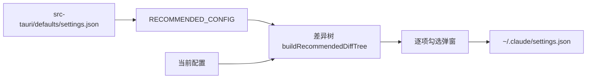

# Claude Code 推荐配置

在设置页 `settings/claude` 点击「加载推荐配置」，aidog 会把内置推荐值与当前配置做差异对比，逐项勾选后才写入。真值源是 `src-tauri/defaults/settings.json`，前端通过 `src/services/claude-settings-schema.ts` 的 `RECOMMENDED_CONFIG` 引用（唯一改动是 `language` 按系统语言探测）。

未勾选的项保持原值；推荐配置里没有、当前配置里有的键会列为「删除」项，同样由你决定是否应用。

## 顶层开关

| 键 | 推荐值 | 说明 |
| --- | --- | --- |
| `language` | 系统语言 | 界面语言，加载时按系统探测，内置默认为 `zh-Hans` |
| `autoConnectIde` | `true` | 在 IDE 终端里启动时自动连接 IDE 扩展 |
| `alwaysThinkingEnabled` | `true` | 默认开启思考，不必每次手动触发 |
| `autoMemoryEnabled` | `true` | 允许自动写入记忆文件 |
| `cleanupPeriodDays` | `30` | 本地会话记录保留天数 |
| `prefersReducedMotion` | `true` | 降低终端动画，长会话更省 CPU |
| `skipDangerousModePermissionPrompt` | `true` | 跳过进入 bypass 模式时的二次确认（与下面的 `defaultMode` 配套） |
| `showThinkingSummaries` | `true` | 显示思考摘要 |
| `showTurnDuration` | `true` | 显示每轮耗时 |
| `autoScrollEnabled` | `true` | 输出时自动滚动到底部 |
| `spinnerTipsEnabled` | `true` | 等待动画处显示提示 |
| `terminalProgressBarEnabled` | `true` | 终端标题栏显示进度 |
| `feedbackSurveyRate` | `0` | 关闭反馈问卷弹出 |
| `teammateMode` | `"in-process"` | 多 agent 协作在同一进程内运行，不额外开终端 |
| `includeCoAuthoredBy` | `false` | commit 不追加 `Co-Authored-By: Claude` |
| `disableClaudeAiConnectors` | `true` | 不自动拉取、连接 claude.ai 的 MCP 连接器 |
| `isolatePeerMachines` | `true` | 跨机器投递 `SendMessage` 前需显式批准 |
| `attribution.commit` / `attribution.pr` | `""` | 清空 commit / PR 的署名尾注 |

`_aidog_statusline`、`_aidog_subagent_statusline`、`_aidog_hooks` 三个 `_aidog_` 前缀键是 aidog 内部标记（statusline 与 Hooks 的开关），不出现在差异列表里，加载推荐配置时随勾选结果一起写入。

## 权限（permissions）

### defaultMode

推荐值 `bypassPermissions`：工具调用不再逐次弹确认。这是效率取向的选择，代价是[官方权限模式文档](https://code.claude.com/docs/en/permission-modes)所述的安全检查一并关闭。三点仍然生效，是这套推荐配置的安全底座：

1. 命中 `deny` 规则的调用**直接被拒**，bypass 模式不放行。
2. 命中 `ask` 规则的调用**仍然弹确认**。
3. `isolatePeerMachines` 的跨机批准仍然弹出。

只想要保守默认时把它改成 `acceptEdits` 或 `default`，其余项都不受影响。

### deny — 凭证禁读

`.env` 系列、`*.key` / `*.pem` / `*.p12` / `*.pfx`、`credentials.json`、`service-account*.json`、`.htpasswd`、`id_rsa` / `id_ed25519` / `id_ecdsa`、`~/.ssh/**`、`~/.aws/**`、`~/.config/gcloud/**`、`~/.kube/config`、`~/.claude/.credentials.json`、`.git-credentials`、`.netrc`、`.npmrc`、`.pgpass`、`*.kdbx`。

覆盖面是「本机凭证会落在哪里」：环境变量文件、私钥、云厂商 CLI 凭证、包管理器 token、数据库密码、密码库。

### deny — 锁文件与已安装依赖禁改

17 个锁文件（`go.sum`、`yarn.lock`、`package-lock.json`、`pnpm-lock.yaml`、`Cargo.lock`、`composer.lock`、`Podfile.lock`、`poetry.lock`、`uv.lock`、`bun.lockb`、`bun.lock`、`deno.lock`、`flake.lock`、`gradle.lockfile`、`packages.lock.json`、`mix.lock`、`.terraform.lock.hcl`）与 10 个依赖目录（`node_modules`、`vendor`、`bower_components`、`.yarn`、`.pnpm-store`、`.venv`、`site-packages`、`Pods`、`~/.cargo/registry`、`~/go/pkg/mod`）。

锁文件要由包管理器生成，不能手改；已安装依赖是构建产物，改了会在下次安装时被覆盖，还会掩盖真正该改的源码。

全部写成 `Edit(...)`：Claude Code 的文件权限检查只匹配 `Edit(path)` 规则，且 `Edit` 规则覆盖包括 `Write` 在内的所有文件编辑工具。写成 `Write(path)` 的规则不会被匹配，等于没拦。

### ask — 依赖清单需确认

`go.mod`、`package.json`、`Cargo.toml`、`Gemfile`、`pyproject.toml`、`requirements.txt`、`Pipfile`、`deno.json`、`bunfig.toml`、`composer.json`、`Podfile`、`mix.exs`，以及构建与容器清单（`flake.nix`、`Makefile`、`Dockerfile`、`CMakeLists.txt`、`pom.xml`、`build.gradle`、`Chart.yaml`、`*.csproj`、`turbo.json` 等），同样全部是 `Edit(...)`。

加依赖是合法操作，所以是 `ask` 而非 `deny` —— 需要你点头，不是一律禁止。

## 环境变量（env）

### 隐私与遥测

| 变量 | 推荐值 | 说明 |
| --- | --- | --- |
| `CLAUDE_CODE_DISABLE_NONESSENTIAL_TRAFFIC` | `1` | 一次关掉自动更新、反馈、错误报告、遥测 |
| `CLAUDE_CODE_ENABLE_TELEMETRY` | `0` | 不启用 OpenTelemetry 采集 |
| `DO_NOT_TRACK` | `1` | 通用退出遥测约定，等价 `DISABLE_TELEMETRY` |
| `CLAUDE_CODE_SUBPROCESS_ENV_SCRUB` | `1` | 从子进程环境剥离 Anthropic 与云厂商凭证 |
| `CLAUDE_CODE_MCP_ALLOWLIST_ENV` | `1` | stdio MCP 服务器只继承安全基线环境 + 自身 `env`，不继承你的 shell |
| `CLAUDE_CODE_HIDE_CWD` | `1` | 启动 logo 不显示工作目录（录屏、截图友好） |
| `CLAUDE_CODE_ATTRIBUTION_HEADER` | `0` | 系统提示省略归属块，同时改善 prompt 缓存命中 |

`DISABLE_TELEMETRY` / `DISABLE_ERROR_REPORTING` 不在推荐配置里：`CLAUDE_CODE_DISABLE_NONESSENTIAL_TRAFFIC=1` 已经覆盖遥测、错误报告、`/feedback`、发布说明与可用性检查。

### 性能与容量

| 变量 | 推荐值 | 说明 |
| --- | --- | --- |
| `CLAUDE_CODE_EFFORT_LEVEL` | `medium` | 默认推理投入档位 |
| `CLAUDE_AUTOCOMPACT_PCT_OVERRIDE` | `80` | 上下文用到 80% 就自动压缩，比默认更早，避免临界爆炸 |
| `BASH_MAX_OUTPUT_LENGTH` | `10240` | bash 输出截断字符数，防止一条命令刷爆上下文 |
| `CLAUDE_CODE_FILE_READ_MAX_OUTPUT_TOKENS` | `10240` | 单次读文件的 token 上限 |
| `CLAUDE_CODE_MAX_TOOL_USE_CONCURRENCY` | `3` | 并发工具调用数，压低本机 IO 与 API 抖动 |
| `ENABLE_PROMPT_CACHING_1H` | `1` | prompt cache TTL 拉到 1 小时，长会话省钱 |
| `CLAUDE_CODE_DISABLE_FAST_MODE` | `1` | 关闭快速模式，稳定优先 |

### 子代理与后台任务

| 变量 | 推荐值 | 说明 |
| --- | --- | --- |
| `CLAUDE_CODE_FORK_SUBAGENT` | `1` | 允许派生 fork subagent（继承上下文，工具输出不污染主线） |
| `CLAUDE_CODE_EXPERIMENTAL_AGENT_TEAMS` | `1` | 启用实验性的 agent 团队协作 |
| `CLAUDE_AUTO_BACKGROUND_TASKS` | `1` | 长时间运行的子代理自动移到后台 |
| `CLAUDE_CODE_DISABLE_BG_EXIT_HANDOFF` | `1` | 会话退出时一并停掉它的后台任务，不留孤儿进程 |
| `CLAUDE_CODE_DISABLE_CRON` | `1` | 禁用计划任务 |
| `CLAUDE_CODE_MAX_SUBAGENTS_PER_SESSION` | `1000` | 单会话 subagent 上限。**自 v2.1.224 起为空操作**，保留仅为兼容旧版本 |

### 网络与插件

| 变量 | 推荐值 | 说明 |
| --- | --- | --- |
| `NO_PROXY` | `localhost,127.0.0.1,192.168.0.0/16,10.0.0.0/8,*.cn` | 本机、内网与国内域名绕过代理，aidog 自己的 `/proxy` 也在其中 |
| `ENABLE_TOOL_SEARCH` | `true` | MCP 工具按需延迟加载，几十个工具时显著省上下文 |
| `CLAUDE_CODE_PLUGIN_PREFER_HTTPS` | `1` | `owner/repo` 简写用 HTTPS 克隆，免 SSH key |
| `CLAUDE_CODE_PACKAGE_MANAGER_AUTO_UPDATE` | `1` | 允许后台执行包管理器升级 |
| `FORCE_AUTOUPDATE_PLUGINS` | `1` | 插件强制自动更新 |
| `CLAUDE_CODE_DISABLE_OFFICIAL_MARKETPLACE_AUTOINSTALL` | `1` | 不自动注册官方插件市场（下面的市场是显式声明的，不受影响） |

## 插件市场与插件

`extraKnownMarketplaces` 显式登记三个市场，均开启 `autoUpdate`：

| 市场 | 仓库 |
| --- | --- |
| `ccplugin-market` | `lazygophers/ccplugin` |
| `claude-code-warp` | `warpdotdev/claude-code-warp` |
| `claude-plugins-official` | `anthropics/claude-plugins-official` |

`enabledPlugins` 里 `claude-code-setup`、`code-modernization`、`code-review`、`code-simplifier` 四个官方插件全部为 `false` —— 市场已登记、随时可开，但默认不加载，不占上下文。

## 相关页面

- [Claude Code 集成](/zh/features/claude-code)
- [接入 Claude Code](/zh/getting-started/connect-claude-code)
- [Codex 推荐配置](/zh/features/recommended-codex) · [pi 推荐配置](/zh/features/recommended-pi)
