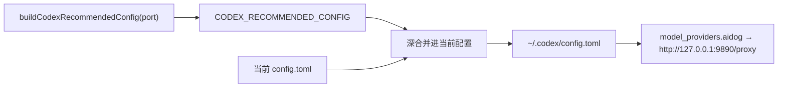

# Codex 推荐配置

在设置页 `settings/codex` 点击「加载推荐配置」，aidog 会把推荐值深合并进当前配置（你已有的键保留，同名键被推荐值覆盖），确认后写入 `~/.codex/config.toml`。

真值源是 `src/services/codex-settings-schema.ts` 的 `buildCodexRecommendedConfig(port)`，端口默认取 `AIDOG_DEFAULT_PORT = 9890`，静态导出 `CODEX_RECOMMENDED_CONFIG` 供页面初始填充与重置默认值。



## 核心

| 键 | 推荐值 | 说明 |
| --- | --- | --- |
| `model` | `gpt-5.5` | 默认模型 |
| `model_provider` | `aidog` | 指向下面声明的 aidog provider，所有请求走本机代理 |
| `model_reasoning_effort` | `medium` | 默认推理投入档位，与 Claude Code 的 `CLAUDE_CODE_EFFORT_LEVEL` 同调 |

## 审批与沙箱

| 键 | 推荐值 | 说明 |
| --- | --- | --- |
| `approval_policy` | `on-request` | 模型判断需要提权时才征求批准，不是每条命令都问 |
| `sandbox_mode` | `workspace-write` | 可写当前工作区，工作区之外只读 |
| `sandbox_workspace_write.network_access` | `false` | 沙箱内禁止联网，命令拿不到网络出口 |

这三项配套：`workspace-write` 限定写入范围，`network_access: false` 断掉数据外传路径，`on-request` 保留人工闸门。想更保守就把 `sandbox_mode` 改成 `read-only`。

## 检索与风格

| 键 | 推荐值 | 说明 |
| --- | --- | --- |
| `web_search` | `cached` | 允许网页检索但走缓存，减少实时外部请求 |
| `personality` | `pragmatic` | 务实风格，少寒暄 |

## 诊断

| 键 | 推荐值 | 说明 |
| --- | --- | --- |
| `analytics.enabled` | `false` | 关闭使用数据上报，与 aidog 的隐私偏好一致 |

## Provider：指向 aidog 代理

```toml
[model_providers.aidog]
name = "aidog proxy"
base_url = "http://127.0.0.1:9890/proxy"
wire_api = "responses"
env_key = "AIDOG_KEY"
```

| 字段 | 说明 |
| --- | --- |
| `base_url` | aidog 本地代理的 `/proxy` 前缀。Codex 实际请求 `base_url + /v1/responses`，aidog 剥掉 `/proxy` 后按 token 路由 |
| `wire_api` | `responses` —— Codex 用 Responses API 线协议 |
| `env_key` | 读取环境变量 `AIDOG_KEY` 作为鉴权 token，值是 **aidog 的分组名** |

端口不是 9890 时，从分组的「复制启动命令」取实际地址，或在设置页改端口后重新加载推荐配置 —— `buildCodexRecommendedConfig(port)` 会按传入端口生成 `base_url`。

## 与 Claude Code 推荐配置的差异

Codex 页的「加载推荐配置」是直接深合并，没有 Claude Code 页那样的逐项勾选弹窗（Codex 侧没有「从 Codex 导入」的差异比对入口）。加载后请在保存前浏览一遍 JSON / GUI 内容确认。

## 相关页面

- [Codex 集成](/zh/features/codex)
- [接入 Codex](/zh/getting-started/connect-codex)
- [Claude Code 推荐配置](/zh/features/recommended-claude-code) · [pi 推荐配置](/zh/features/recommended-pi)
