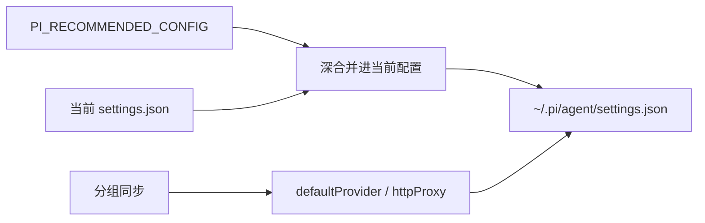

# pi 推荐配置

在设置页 `settings/pi` 点击「加载推荐配置」，aidog 会把推荐值深合并进当前配置，确认后写入 pi 全局设置 `~/.pi/agent/settings.json`（根目录可用 `PI_CODING_AGENT_DIR` 改）。aidog 不认识的键原样保留，不会被覆盖。

真值源是 `src/services/pi-settings-schema.ts` 的 `PI_RECOMMENDED_CONFIG` —— pi 官方默认加上 aidog 的隐私偏好。

## 推荐值

| 键 | 推荐值 | 说明 |
| --- | --- | --- |
| `defaultThinkingLevel` | `medium` | 默认思考等级。可选 `off` / `minimal` / `low` / `medium` / `high` / `xhigh` / `max` |
| `defaultProjectTrust` | `ask` | 首次进入新项目时询问是否信任，不默认全信 |
| `theme` | `dark` | 界面主题 |
| `quietStartup` | `false` | 保留启动信息，便于确认接的是哪个 provider |
| `hideThinkingBlock` | `false` | 显示思考块 |
| `enableInstallTelemetry` | `false` | 关闭安装遥测 |
| `enableAnalytics` | `false` | 关闭使用分析上报 |

两项遥测关闭与 Codex 页 `analytics.enabled = false`、Claude Code 页 `DO_NOT_TRACK=1` 同调。

## 由 aidog 接管的键，不要手改

| 键 | 谁在写 |
| --- | --- |
| `defaultProvider` | 标记默认分组时由 aidog 写入，值形如 `aidog-<分组名>` |
| `httpProxy` | 由 aidog 的出站代理设置写入，同时作用于 `HTTP_PROXY` 与 `HTTPS_PROXY` |

这两项不在推荐配置里。在 pi 设置页手改后，**下一次分组同步会按 aidog 侧的值覆盖回去** —— 要改就去 aidog 的分组与代理设置里改。

provider 列表本身也不在这份 settings 里：由 `src-tauri/crates/aidog_core/src/gateway/pi.rs` 生成写进 `~/.pi/agent/models.json`，每个 aidog 分组一个 `aidog-<分组名>` provider，同步时只清扫 `aidog-` 前缀的条目。规则见[接入 pi](/zh/getting-started/connect-pi)。

## 其余可调项

schema 还覆盖这些键，推荐配置不给默认值，按需自己填：`defaultModel`、`thinkingBudgets`（各思考等级的 token 预算）、`externalEditor`（如 `code -w`）、`showCacheMissNotices`。

## 与 Claude Code 推荐配置的差异

pi 页的「加载推荐配置」是直接深合并，没有 Claude Code 页那样的逐项勾选弹窗。另外 MCP、通知 Hooks、statusline、cc-switch 导入四项对 pi 不适用，Skills 对 pi 是常开徽标而非开关 —— 详见 [pi 集成](/zh/features/pi)。

## 相关页面

- [pi 集成](/zh/features/pi)
- [接入 pi](/zh/getting-started/connect-pi)
- [Claude Code 推荐配置](/zh/features/recommended-claude-code) · [Codex 推荐配置](/zh/features/recommended-codex)
